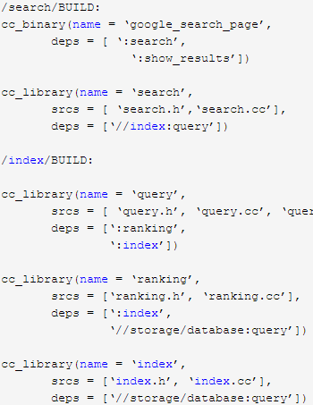
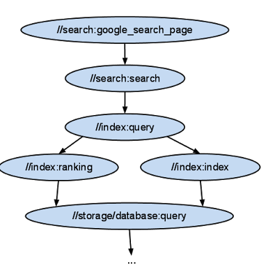
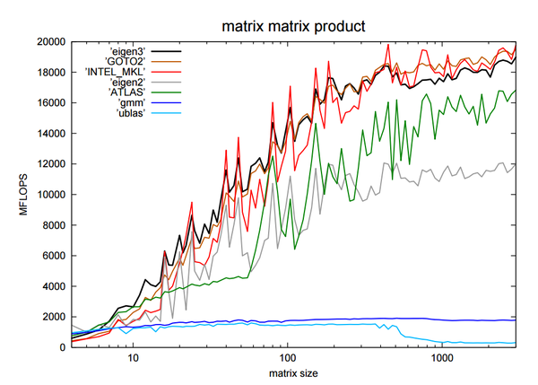

# 入门准备工作

tensorflow使用了自动化构建工具bazel、脚本语言调用c或cpp的包裹工具swig、使用EIGEN作为矩阵处理工具、Nvidia-cuBLAS GPU加速计算库、结构化数据存储格式protobuf

### Swig

Simplified Wrapper and Interface Generator (SWIG) ，基本思想就是向脚本语言接口公开 C/C++ 代码。SWIG 允许您向广泛的脚本语言公开 C/C++ 代码，包括 Ruby、Perl、Tcl 和 Python

参考：
使用SWIG实现Python调用C/C++代码

### Bazel

bazel假定每个目录为[package]单元，目录里面包含了源文件和一个描述文件BUILD，描述文件中指定了如何将源文件转换成构建的输出

* name属性来命名规则，deps属性来描述规则之间的依赖关系
* 使用**冒号**来分隔包名和规则名；如果某条规则所依赖的规则在其他目录下，就用"//"开头，如果在同一目录下，可以忽略包名而用冒号开头

### EIGEN
* Eigen is a C++ template library for linear algebra: matrices, vectors, numerical solvers, and related algorithms. [http://eigen.tuxfamily.org/](http://eigen.tuxfamily.org/ )
* 常用的矩阵计算工具有blas, cublas(caffe)、atlas、openblas(mxnet)、eigen，还有lapack、mkl(intel)、Armadillo（matlab）

### protobuf
* Protocol Buffers 是一种轻便高效的结构化数据存储格式，可以用于结构化数据串行化，或者说序列化。它很适合做数据存储或 RPC 数据交换格式。可用于通讯协议、数据存储等领域的语言无关、平台无关、可扩展的序列化结构数据格式。
* 使用
	> 编写.proto文件，编译后生成 .pb.h / .pb.cc文件
	> Writer: SerializeToOstream(),   Reader: ParseFromIstream()
	> required：一个格式良好的消息一定要含有1个这种字段；
	> optional：消息格式中该字段可以有0个或1个值（不超过1个）。
	> repeated：在一个格式良好的消息中，这种字段可以重复任意多次（包括0次）。相当于java中的List。

* grpc需要理解4个方面（service，stub，channel，observer）
	- service
	- stub：客户端调用 stub 对象，所谓 stub 对象就是具有声明好的方法的 fake object。stub 对象将请求用 protobuf 方式序列化成字节流，用于线上传输，到 server 端后调用真正的实现对象处理。
	- channel：指定连接的服务器地址和端口，用于stub连接到service
	- observer：服务端，观察处理返回和关闭通道
### TF C++
[tutorial for adding a new op in C++](http://wiki.jikexueyuan.com/project/tensorflow-zh/how_tos/adding_an_op.html)
[debugging Tensorflow's C++ code behind the SWIG interface](http://stackoverflow.com/questions/36399337/debugging-tensorflows-c-code-behind-the-swig-interface)