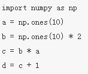
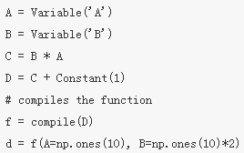
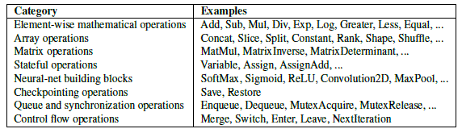

# TF系统概述篇
### Rendezvous

* A Rendezvous is an abstraction for passing a Tensor from a producer to a consumer where the consumer may safely request the Tensor before or after it has been produced.  A producer never blocks when using a Rendezvous. A consumer has the choice of making a blocking call or providing a callback: in either case, the consumer receives the Tensor as soon as it is available 
**Nonblocking send, blocking receive**
* A Rendezvous key encodes a single <producer, consumer\> pair.  It is an error to call Send() or Recv*() more than once with the same key
* 在消息通信机制中，消息传递涉及到信箱容量问题。一个极端的情况是信箱容量为0，那么，当send在receive之前执行的话，则发送进程被阻塞，直到receive做完。执行receive时信件可从发送者直接拷贝到接收者，不用任何中间缓冲。类似的，如果receive先被执行，接受者将被阻塞直到send发生。上述策略称为回合（rendezvous）原则。
* tensorflow 的消息传递属于**发送不阻塞，接收阻塞**，实现场景有以下两种:
	- LocalRendezvous （本地消息传递）
	- RpcRemoteRendezvous (分布式消息传递)
	- IntraProcessRendezvous  (rendezvous_mgr.h)，本地不同设备间通信
* 在Op Kernels中，有SendOp和RecvOp两个类(kernels/sendrecv_ops.h)，与Rendezvous结合使用
* [minix消息传递中rendezvous概念](http://blog.9i0i.com/?xinghun_4/article/details/8253780)

### 符号编程
[MXNet设计笔记之：深度学习的编程模式比较](http://www.csdn.net/article/2015-10-11/2825883)

|命令式（灵活）|符号式（高效）|
|-|-|
| ||

### Session
* A Session instance lets a caller drive a TensorFlow graph computation
* relate files: 
	- /tensorflow/core/public/session.h, 
	- /tensorflow/core/common_runtime/[[session.cc, session_factory.cc, session_factory.h, session_options.cc, session_state.cc]]
* 客户程序通过会话（Session）与TensorFlow系统进行交互。在Session建立时运算流图初始状态为空图。为创建运算流图，TensorFlow通过Session接口的Extend函数，把额外的节点和边扩充到当前的运算流图中
* Run()是Session接口中另一个重要的函数。Run()函数的参数包括最终运算输出的变量名，及运算流图中涉及到的张量运算集。为得到所期望的输出结果，运行过程中TensorFlow对所有节点进行传递闭包运算。并遵照节点间的运算依赖关系进行序。在大部分的TensorFlow应用中，一般构建一次Session，然后通过调用Run()对整个运算流图或是部分独立的子图进行多次运算。
<center></center>

### 目录
```
core/
├── BUILD: 				bazel编译文件，相关编译函数定义在.bzl文件中
├── common_runtime
├── debug
├── distributed_runtime
├── example
├── framework
├── graph: DAG图相关
├── kernels: 			核心Op，如【matmul, conv2d, argmax, batch_norm】等
├── lib: 				基础公共库【core, gif, gtl, hash, histogram, io, jpeg, monitoring, png, random, strings】
├── ops: 				均为.cc文件，为基本op操作、流运算、以及定义了op梯度计算方式
├── platform			平台相关文件，如设备内存分配
├── protobuf			均为.proto文件，用于数据传输时的结构序列化
├── public				公共头文件，用于外部接口调用的API定义，主要是(session.h,   tensor_c_api.h)
├── user_ops			用户自定义op
└── util
```