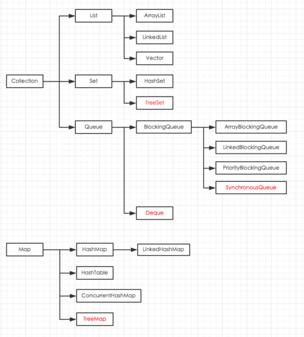
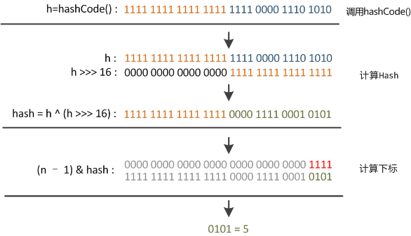

## Java 集合总结




* HashMap：发生哈希冲突的Node会加入到链表的最下端；哈希冲突过多的情况下链表会**变成红黑树**从而保证效率；非同步，不保证顺序。允许有空值和空键。
* LinkedHashMap：继承HashMap，Iterator下能保证插入的先后顺序，原理是在LinkedHashMap中加入了链表，并且该链表还是一个双向链表。迭代访问时比HashMap更快。
* TreeMap：能够根据key值来**有序**插入，原理使用了红黑树，每次插入都会对树进行调整。
* HashTable：HashMap的线程安全版本，内部的实现几乎和 HashMap 一模一样。但是由于其同步是使用了 synchronized，效率较低。
* ConcurrentHashMap：也是HashMap的线程安全版本，并且使用了分段加锁机制，所以效率上要比HashTable要好很多。

## ArrayList
ArrayList实现了List接口,意味着可以插入空值，也可以插入重复的值，非同步，它是基于数组的一个实现。

**重要成员变量**：

```java
private static final int DEFAULT_CAPACITY = 10; //默认初始值    
transient Object[] elementData;                 //存放数据的数组 
```

对于`add()`方法，首先通过`ensureCapacityInternal(size + 1)`判断需不需要扩容,然后再进行`elementData[size++] = e`。 插入的时间复杂度O(1)。是非常高效的。如果在固定位置插入，那么代码 `System.arraycopy(elementData, index, elementData, index + 1, size - index);`这个可以看出，这时候就是比较低效的了。

**那么网上很多说ArrayList不适合增删操作非常多的操作，这是怎么回事呢？**首先可以看到这句话：`elementData = Arrays.copyOf(elementData, newCapacity)`; 需要知道的是，`Arrays.copyOf`函数的内部实现是再创建一个数组，然后把旧的数组的值一个个复制到新数组中。当经常增加操作的时候，容量不够的时候，就会进行上述的扩容操作，这样性能自然就下来了。或者说，当我们在固定位置进行增删的时候，都会进行`System.arraycopy(elementData, index, elementData, index + 1, size - index);`也是非常低效的。

**总结**
* ArrayList 可以插入空值，也可以插入重复值
* ArrayList 是基于数组的时候，所以很多数组的特性也直接应用到了 ArrayList。
* ArrayList 的性能消耗主要来源于扩容和固定位置的增删。
* ArrayList 创建的时候 需要考虑是否要初始化最小容量，以此避免扩容带来的消耗。

## LinkedList

LinkedList 不同于ArrayList 和Vector，它是使用链表的数据结构，不再是数组。

当进行增删的时候，只需要改变指针，并不会像数组那样出现整体数据的大规模移动，复制等消耗性能的操作。

## HashMap

HashMap 有两个参数影响性能：

* 初始容量：表示哈希表在其容量自动增加之前可以达到多满的一种尺度
* 加载因子：当哈希表中的条目超过了容量和加载因子的乘积的时候，就会进行重哈希操作。

如下成员变量源码：
```java
static final float DEFAULT_LOAD_FACTOR = 0.75f;
static final int DEFAULT_INITIAL_CAPACITY = 1 << 4;
transient Node<K,V>[] table;
```

可以看到，默认加载因子为 0.75，默认容量为 1 << 4，也就是 16。加载因子过高，容易产生哈希冲突，加载因子过小，容易浪费空间，0.75是一种折中。

另外，整个 HashMap 的实现原理可以简单的理解成： 当我们 put 的时候，首先根据 key 算出一个数值 x，然后在 table[x] 中存放我们的值。 这样有一个好处是，以后的 get 等操作的时间复杂度直接就是O(1)，因为 HashMap 内部就是基于数组的一个实现。

###哈希冲突

哈希冲突：通俗的讲就是首先我们进行一次 put 操作，算出了我们要在 table 数组的 x 位置放入这个值。那么下次再进行一个 put 操作的时候，又算出了我们要在 table 数组的 x 位置放入这个值，那之前已经放入过值了，那现在怎么处理呢？其实就是通过链表法进行解决。

put函数大致的思路为：

1. 对key的hashCode()做hash，然后再计算index;
2. 如果没碰撞直接放到bucket里；
3. 如果碰撞了，以链表的形式存在buckets后；
4. 如果碰撞导致链表过长(大于等于TREEIFY_THRESHOLD)，就把链表转换成红黑树；
5. 如果节点已经存在就替换old value(保证key的唯一性)
6. 如果bucket满了(超过load factor*current capacity)，就要resize。

get函数的实现：

1. bucket里的第一个节点，直接命中；
2. 如果有冲突，则通过key.equals(k)去查找对应的entry。若为树，则在树中通过key.equals(k)查找，O(logn)；若为链表，则在链表中通过key.equals(k)查找，O(n)。

hash函数的实现：

在get和put的过程中，计算下标时，先对hashCode进行hash操作，然后再通过hash值进一步计算下标

```java
static final int hash(Object key) {
    int h;
    return (key == null) ? 0 : (h = key.hashCode()) ^ (h >>> 16);
}
```



可以看到这个函数大概的作用就是：高16bit不变，低16bit和高16bit做了一个异或。

## LinkedHashMap

LinkedHashMap 继承于 HashMap，很多方法都是直接用了 HashMap 的方法，那么本身再在 HashMap 的基础上提供一个排序的功能。

在HashMap中提到了下面的定义：

```java
// Callbacks to allow LinkedHashMap post-actions
void afterNodeAccess(Node<K,V> p) { }
void afterNodeInsertion(boolean evict) { }
void afterNodeRemoval(Node<K,V> p) { }
```

上面3个函数基本上都是为了保证双向链表中的节点次序或者双向链表容量所做的一些额外的事情，目的就是保持双向链表中节点的顺序要从eldest到youngest。

